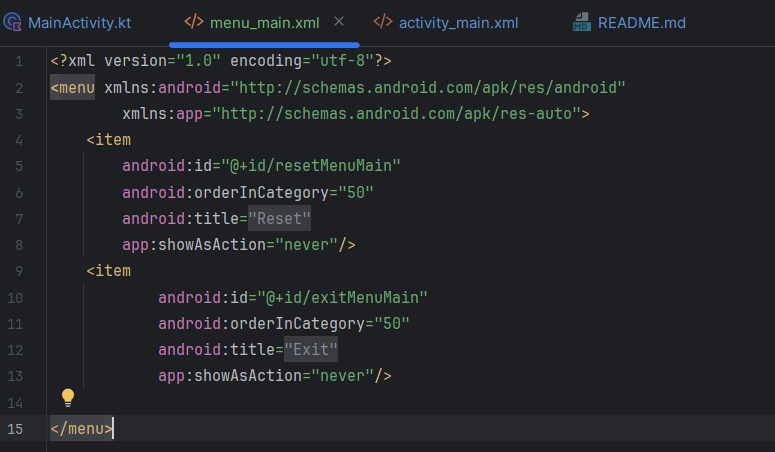
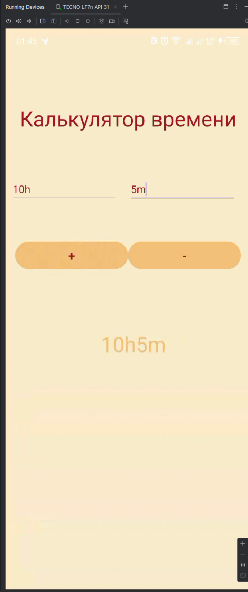
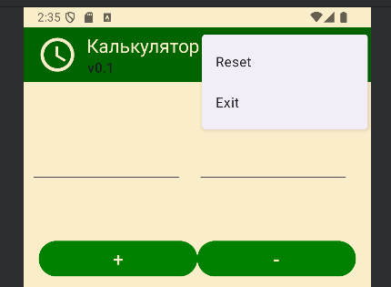
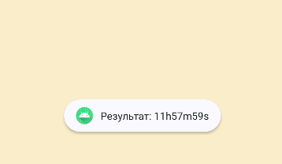
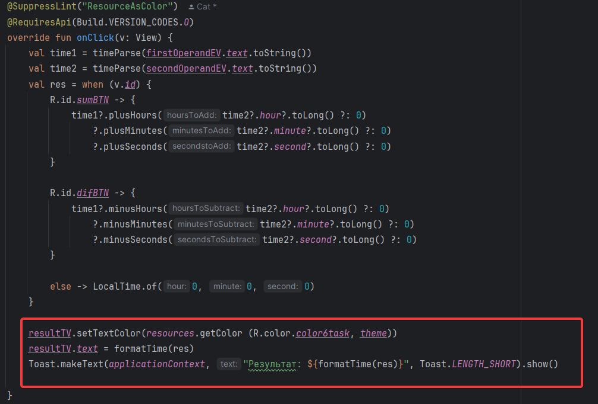
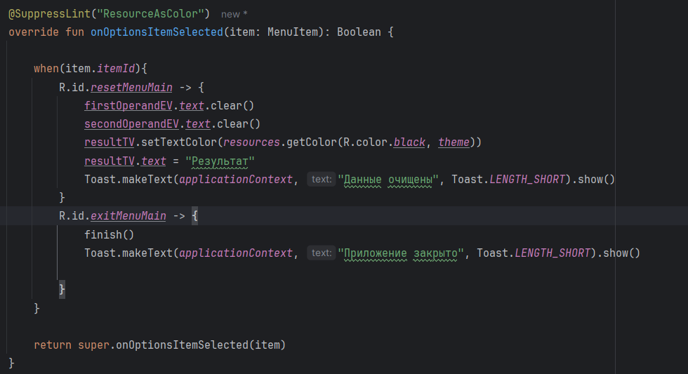
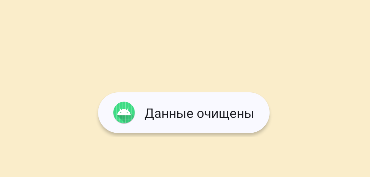
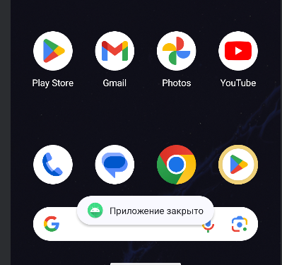
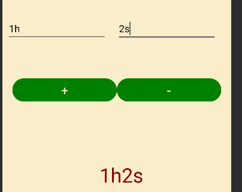
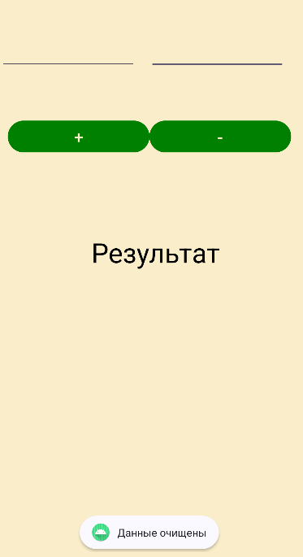

# Time calculator program

Простое приложение для расчёта времени

## Скриншоты

<h2>Задание 1</h2>
<h4>Добавить Toolbar с логотипом, заголовком и подзаголовком. Цвет Toolbar: #006400 </h4>


<h2>Задание 2</h2>
<h4>Изменить цвет кнопок приложения: #008000</h4>


<h2>Задание 3</h2>
<h4>Добавить menu удаления полей ввода и вывода, описать логику работы (аналогично занятию).</h4>




<h2>Задание 4</h2>
<h4>Добавить всплывающее сообщение Toast с результатом при выполнении функций сложения и вычитания времени, например, «Результат: 23m45s».</h4>



<h2>Задание 5</h2>
<h4>Добавить всплывающее сообщение при очистке полей ввода и вывода - «Данные очищены», при закрытии приложения – «Приложение закрыто».</h4>




<h2>Задание 6</h2>
<h4>***Изменить текст вывода информации на #8B0000 при выводе результата, при очистке и по умолчанию (при запуске) – черный.</h4>



## Установка

Инструкции по установке проекта:

1. Клонируйте репозиторий:
   ```bash
   git clone --branch=Toolbar-Menu-Toast https://github.com/PawPrintsInTheDark/AndroidLessons.git
