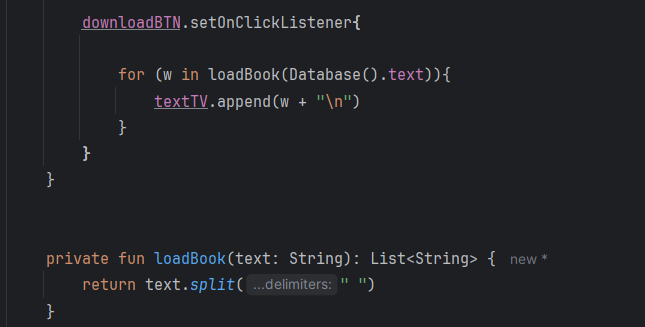

## Скриншоты

#### 1. На экране приложения необходимо создать заголовок «Электронная книга».

#### 2. Необходимо создать кнопку «Загрузить» для загрузки электронной книги базы данных.


#### 3. В качестве базы данных необходимо создать класс database.kt, в котором будет находиться в переменной text небольшой художественный рассказ.

 

#### 4. В классе MainActivity при нажатии кнопки загрузки книга загружается из базы данных. Для этого нужно написать функцию loadBook(text: String): List<String>, она возвращает список отдельно взятых слов этой книги.



#### 5. В текстовое поле вывода под кнопкой мы получаем текст книги в результате работы с полученным списком. Т.к. весь текст, вероятно, не поместится в размеры экрана, необходимо чтобы он скролился.

    

## Установка

Инструкции по установке проекта:

1. Клонируйте репозиторий:
```bash
git clone --branch=RelativeLayoutToggleButtonScrollView  https://github.com/PawPrintsInTheDark/AndroidLessons.git
```