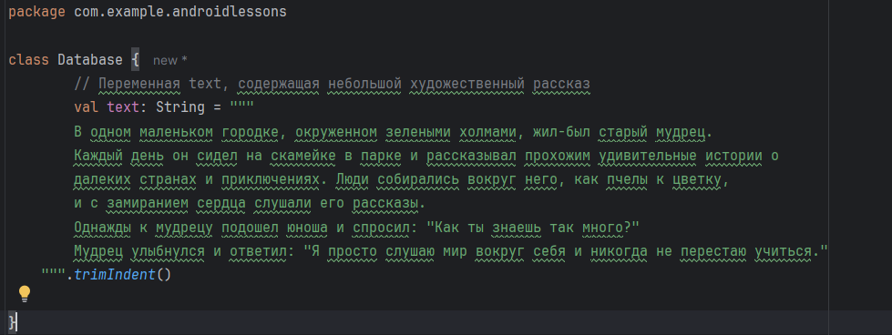

# Time calculator program

Простое приложение для расчёта времени

## Скриншоты


## 1.    Создать поле ввода текста, в которое мы будем ставить оценку за урок.


## 2.    После того, как оценка выставлена в поле. Мы вызываем контекстное меню, у него два пункта: «Цветовое качество», «Выход из приложения».


## 3.    При нажатии на «Цветовое качество»: если выставлена 1 – поле окрашивается в оранжевый цвет, 2 – желтый, 3 – зеленый, 4 – синий, 5 – красный.


## 4.    При выборе пункта «Выход из приложения» - выходим из приложения.


## 5.    *** Дополнительно. Создать кнопку «Случайное число». При нажатии на кнопку в текстовое поле выводится число, генерируемое случайным порядком, допустим от 1 до 50. При нажатии на поле вызывается контекстное меню, с пунктами, описанными выше. Если выбран пункт «Цветовое качество», то числа от 1 до 10 включительно окрашиваются в красный цвет, 11-20 – оранжевый, 21-30 – желтый, 31-40 – зеленый, 41-50 – синий.


## Установка

Инструкции по установке проекта:

1. Клонируйте репозиторий:
   ```bash
   git clone --branch=ContextMenu ♦https://github.com/PawPrintsInTheDark/AndroidLessons.git
